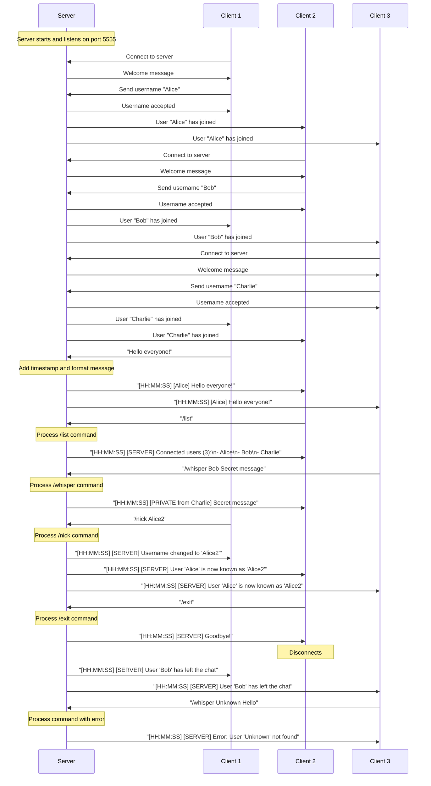

```mermaid
sequenceDiagram
    participant Server
    participant Client1 as Client 1
    participant Client2 as Client 2
    participant Client3 as Client 3
    
    %% Server Initialization
    Note over Server: Server starts and listens on port 5555
    
    %% Client 1 Connection
    Client1->>Server: Connect to server
    Server->>Client1: Welcome message
    Client1->>Server: Send username "Alice"
    Server->>Client1: Username accepted
    Server->>Client2: User "Alice" has joined
    Server->>Client3: User "Alice" has joined
    
    %% Client 2 Connection
    Client2->>Server: Connect to server
    Server->>Client2: Welcome message
    Client2->>Server: Send username "Bob"
    Server->>Client2: Username accepted
    Server->>Client1: User "Bob" has joined
    Server->>Client3: User "Bob" has joined
    
    %% Client 3 Connection
    Client3->>Server: Connect to server
    Server->>Client3: Welcome message
    Client3->>Server: Send username "Charlie"
    Server->>Client3: Username accepted
    Server->>Client1: User "Charlie" has joined
    Server->>Client2: User "Charlie" has joined
    
    %% Regular Message
    Client1->>Server: "Hello everyone!"
    Note over Server: Add timestamp and format message
    Server->>Client2: "[HH:MM:SS] [Alice] Hello everyone!"
    Server->>Client3: "[HH:MM:SS] [Alice] Hello everyone!"
    
    %% Command: /list
    Client2->>Server: "/list"
    Note over Server: Process /list command
    Server->>Client2: "[HH:MM:SS] [SERVER] Connected users (3):\n- Alice\n- Bob\n- Charlie"
    
    %% Private Message
    Client3->>Server: "/whisper Bob Secret message"
    Note over Server: Process /whisper command
    Server->>Client2: "[HH:MM:SS] [PRIVATE from Charlie] Secret message"
    
    %% Change Username
    Client1->>Server: "/nick Alice2"
    Note over Server: Process /nick command
    Server->>Client1: "[HH:MM:SS] [SERVER] Username changed to 'Alice2'"
    Server->>Client2: "[HH:MM:SS] [SERVER] User 'Alice' is now known as 'Alice2'"
    Server->>Client3: "[HH:MM:SS] [SERVER] User 'Alice' is now known as 'Alice2'"
    
    %% Disconnection
    Client2->>Server: "/exit"
    Note over Server: Process /exit command
    Server->>Client2: "[HH:MM:SS] [SERVER] Goodbye!"
    Note over Client2: Disconnects
    Server->>Client1: "[HH:MM:SS] [SERVER] User 'Bob' has left the chat"
    Server->>Client3: "[HH:MM:SS] [SERVER] User 'Bob' has left the chat"
    
    %% Error Handling
    Client3->>Server: "/whisper Unknown Hello"
    Note over Server: Process command with error
    Server->>Client3: "[HH:MM:SS] [SERVER] Error: User 'Unknown' not found"
```
