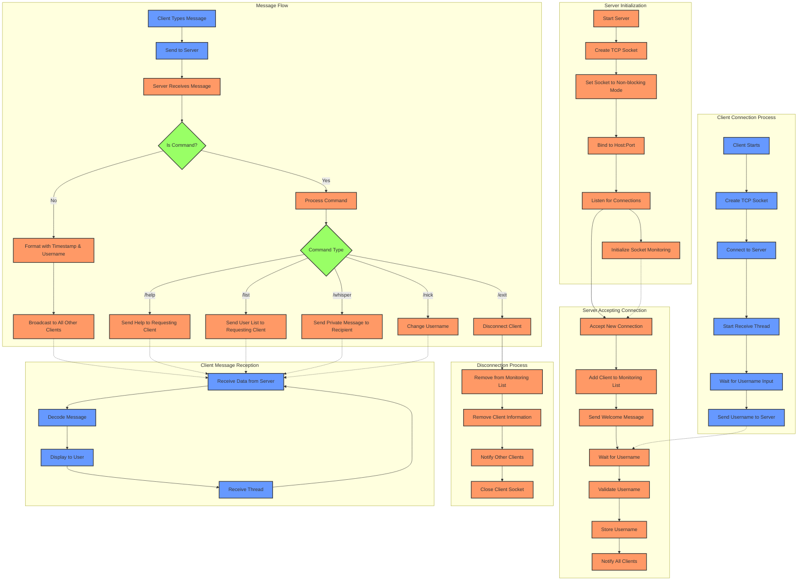

```mermaid
graph TD
    %% Server Initialization
    subgraph "Server Initialization"
        A[Start Server] --> B[Create TCP Socket]
        B --> C[Set Socket to Non-blocking Mode]
        C --> D[Bind to Host:Port]
        D --> E[Listen for Connections]
        E --> F[Initialize Socket Monitoring]
    end

    %% Client Connection
    subgraph "Client Connection Process"
        G[Client Starts] --> H[Create TCP Socket]
        H --> I[Connect to Server]
        I --> J[Start Receive Thread]
        J --> K[Wait for Username Input]
        K --> L[Send Username to Server]
    end

    %% Server Accepting Connection
    subgraph "Server Accepting Connection"
        E --> M[Accept New Connection]
        M --> N[Add Client to Monitoring List]
        N --> O[Send Welcome Message]
        O --> P[Wait for Username]
        P --> Q[Validate Username]
        Q --> R[Store Username]
        R --> S[Notify All Clients]
    end

    %% Message Flow
    subgraph "Message Flow"
        %% Client to Server
        T[Client Types Message] --> U[Send to Server]
        U --> V[Server Receives Message]
        
        %% Server Processing
        V --> W{Is Command?}
        W -- Yes --> X[Process Command]
        W -- No --> Y[Format with Timestamp & Username]
        
        %% Server to Clients
        Y --> Z[Broadcast to All Other Clients]
        X --> AA{Command Type}
        AA -- /help --> AB[Send Help to Requesting Client]
        AA -- /list --> AC[Send User List to Requesting Client]
        AA -- /whisper --> AD[Send Private Message to Recipient]
        AA -- /nick --> AE[Change Username]
        AA -- /exit --> AF[Disconnect Client]
    end

    %% Disconnection Process
    subgraph "Disconnection Process"
        AF --> AG[Remove from Monitoring List]
        AG --> AH[Remove Client Information]
        AH --> AI[Notify Other Clients]
        AI --> AJ[Close Client Socket]
    end

    %% Client Receiving
    subgraph "Client Message Reception"
        AK[Receive Thread] --> AL[Receive Data from Server]
        AL --> AM[Decode Message]
        AM --> AN[Display to User]
        AN --> AK
    end

    %% Connect the subgraphs
    F -.-> M
    L -.-> P
    Z -.-> AL
    AB -.-> AL
    AC -.-> AL
    AD -.-> AL
    AE -.-> AL

    %% Styling
    classDef server fill:#f96,stroke:#333,stroke-width:2px
    classDef client fill:#69f,stroke:#333,stroke-width:2px
    classDef process fill:#9f6,stroke:#333,stroke-width:2px
    
    class A,B,C,D,E,F,M,N,O,P,Q,R,S,V,W,X,Y,Z,AA,AB,AC,AD,AE,AF,AG,AH,AI,AJ server
    class G,H,I,J,K,L,T,U,AK,AL,AM,AN client
    class W,AA process
```
